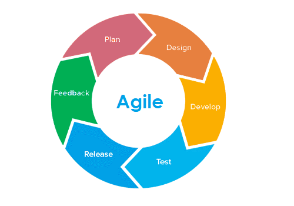

### Agile
Agile – metodyka zwinna zarządzania w IT. Jest to rodzaj wytwarzania oprogramowania na podstawie modelu iteracyjno-przyrostowego powstały jako alternatywa dla metodyki typu waterfall (modelu klasycznego). Najważniejsze założenia metody to obserwacja oczekiwań klienta lub zmian otoczenia i zwinne reagowanie na zmieniające się okoliczności.

##### Zwinne podejście agile
- Brak dokładnego z góry zdefiniowanego planu wdrożenia
- Podział prac na lepiej mierzalne i zarządzalne cykle (sprinty)
- Elastyczność do wprowadzania zmian w trakcie projektu oraz zmian w budżecie projektowym
- Działanie zgodnie z priorytetyzacją w projekcie. Lista priorytetów ustalana w zespole scrumowym
- Proces projektowy prowadzony tak, aby dotrzeć do wyznaczonego celu, bez z góry określonych ram
- Pozostawiona przestrzeń oraz elastyczność zespołowi do znajdywania najszybszych i optymalnych dróg w projektowaniu rozwiązań

##### Etapy realizacji zadań projektowych w oparciu o agile
Na podstawie metodyki agile w IT wyróżnia się etapy następujące jeden po drugim:
- plan (planowanie)
- design (projektowanie)
- develop (programowanie)
- test (testowanie)
- release (implementacja)
- feedback (informacja zwrotna)

### Kanban
Jest to jedna z najpopularniejszych metodyk zarządzania projektami i pozwala na przedstawienie działań w formie wizualnej. Dzięki niej można śledzić zadania i zwiększać efektywność prowadzenia prac.

Opiera się na tablicy Kanban, gdzie fazy projektu podzielone są na kolumny. Zadania zapisywane są na kartach, które przechodzą z jednej kolumny do drugiej aż do czasu zakończenia zadania.

Zaletą stosowania metodyki Kanban jest ułatwienie zespołowi przeprowadzenia prac. Wszyscy jego członkowie wiedzą, jakie zadania powinni w danej kolejności wykonać, co pozwala im ustalać priorytety. Dzięki graficznemu przedstawieniu projekt staje się przejrzysty. Każdy członek zespołu może mieć dostęp do tablicy poprzez oprogramowanie, wywiesza się ją często także w formie „analogowej” w biurze.

### Scrum
Scrum był pierwszym wyrazem metodologii zwinnej (Agile). Nie ma w nim podziału na analityków, testerów i programistów. Wszystkie te funkcje pełni developer. Członkowie zespół Scrum mają mieć interdyscyplinarne kompetencje i ściśle ze sobą współpracują.

Proces jest doglądany przez Scrum Mastera. Nie pełni on jednak roli kierownika projektu, a jedynie dogląda przebiegu prac. Scrum Owner to klient, który jest zaangażowany w projekt i udziela informacji zwrotnych.

Scrum opiera się na iteracjach w formie sprintów, gdzie wykonywane są wszystkie etapy. Każdy sprint zostaje poddany testom i ewaluacji. W kolejnym wyznacza się następne działania lub wskazuje te, które wymagają poprawy czy powtórzenia.

Tablica SCRUM jest resetowana po zakończeniu każdego sprintu.

### Różnice między Kanban a Scrum
Zarówno Kanban, jak i Scrum należą do metodyk zwinnych (agile), istnieją jednak między nimi istotne różnice. Zdając sobie z nich sprawę, można podjąć decyzje, który ze sposobów zarządzania wybrać do danego projektu.

##### Rytm pracy
**Kanban** pozwala na elastyczność, ponieważ wyniki są dostarczane w sposób ciągły. Oczywiście menedżerowie często ustalają deadline'y dla całego projektu, ale możliwe jest zakończenie danych etapów dopiero wtedy, gdy wszystkie niezbędne czynności zostaną wykonane odpowiednio. Rygor czasowy jest mniejszy.

W **Scrum** mamy do czynienia z ustalonym czasem na wykonanie całego sprintu (z reguły 2 do 4 tygodni) co sprzyja realizacji bardziej precyzyjnego harmonogramu. Uczestnicy projektu muszą się go trzymać, dzięki czemu można na liczyć na większą produktywność. Wyniki pracy należy dostarczać do odbioru zgodnie z góry ustalonymi terminami.

Spotkania w **Kanban** nie są obowiązkowe.

Spotkania w **Scrum** są niezbędne. Jest to planowanie sprintów, codzienna "odprawa" przed realizację zadań (mająca na celu wyznaczanie zadań i ich przeglądy) oraz retrospektywy sprintów.

##### Role i obowiązki członków zespołu
**Scrum** wymaga wyznaczenia odpowiednich osób do konkretnych działań. Istnieją Scrum Master, Scrum Owner i Scrum Team, czyli zespół programistów. Scrum Master wyznacza zakres działań dla każdej z osób ze Scrum Team. Mimo to członkowie Scrum Team, czyli deweloperzy, powinni być interdyscyplinarni.

W **Kanban** wyznaczanie ról nie jest obowiązkowe. Można elastyczne decydować o zestawie obowiązków dla każdego z uczestników projektu w miarę jego przebiegu. Zespół powinien współpracować i jego członkowie mogą przejmować obowiązki innych, (np. gdy ci są przytłoczeni nadmiarem pracy). Cały zespół jednak powinien mieć kompetencje odpowiednie do danego produktu.

##### Wprowadzanie zmian
W **Scrum** podczas sprintu odradza się dokonywania zmian. Jego efekty powinny być dostarczone do oceny po określonym czasie bez ewaluacji wyników pracy w trakcie.

**Kanban** pozwala na wprowadzanie zmian i wykonywanie etapów w formie iteracji, po których ocenia się ich wyniki. W razie potrzeby etapy są powtarzane.

##### Kanban czy Scrum?
Wybór najlepszej metodologii do prac przy projekcie zależy od jego charakteru. Ogólnie rzecz biorąc, **Kanban** wspiera doskonalenie zespołu, ale droga do ewaluacji trwa dłużej.

**Scrum** sprzyja wyższej produktywności, szybszej dostawie i niższym kosztom. Dobrze spisuje się w projektach, które mogą wymagać częstych zmian. Sprawdzi się, jeśli tworzymy np. oprogramowanie, którego development ze względu na branżę musi elastycznie reagować na potrzeby rynku i konsumentów oraz działania konkurencji.

###### Oto cechy Kanbana, które go wyróżniają:

**Tablica Kanban:** Tablice Kanban umożliwiają wizualizację pracy zespołu. Oprócz podziału pracy zespoły mogą dodawać więcej kategorii tam, gdzie jest to potrzebne. Możesz zapisywać zadania na karcie Kanban, a następnie przenosić je w miarę postępów w grupie. Zarząd na bieżąco informuje członków o statusie zadań i pomaga identyfikować obszary problematyczne. Oznacza to, że wprowadzanie poprawek jest znacznie łatwiejsze.

**Limity WIP:** Kanban wymusza ograniczenie liczby zadań w toku w określonym czasie. Zespół sam decyduje o limicie kart. Jeśli osiągniesz limit, nie będziesz mógł dodać nowego projektu, chyba że ukończysz go i przeniesiesz na inną listę. Dzięki temu identyfikacja wąskich gardeł staje się znacznie prostsza, a zespoły mogą współpracować, aby je rozwiązać.

**Ciągłe doskonalenie:** Metodologia Kanban umożliwia zespołom częste spotykanie się i omawianie zmian. Dane z tablicy pomagają ukierunkować te dyskusje. Takie spotkania mogą skorygować przepływ pracy bez radykalnych zmian.

###### Oto, co jest unikalne dla metodologii Scrum:

**Sprinty:** Scrum wymusza dwutygodniowe zakończenie pracy. Planowanie sprintu odbywa się z wyprzedzeniem, a zespół przegląda go po jego wykonaniu. Zespół tworzy backlog sprintu, realizując zadania w trakcie sprintu. Zarządzają pracą między sobą.

**Scrum Master:** Scrum Master to łącznik pomiędzy właścicielem produktu a zespołem. Scrum Master rozumie wymagania właściciela produktu. Następnie pomaga drużynie w tworzeniu sprintów. Podczas sprintu to on radzi sobie z wszelkimi przeszkodami.

**Wykresy spalania:** Dzięki temu wykresowi członkowie zespołu uzyskują przegląd postępów. Wykres spalania podkreśla zadania, które należy jeszcze wykonać, a nie te, które zostały ukończone.

Używa się także obu metodyk poprzez **Scrumban**. Wykorzystywane są w nim wizualizacje przebiegu prac Kanban i procesy Scrum. Jeżeli zatem nasz produkt wymaga jednocześnie elastyczności i produktywności, możemy się na niego zdecydować.
